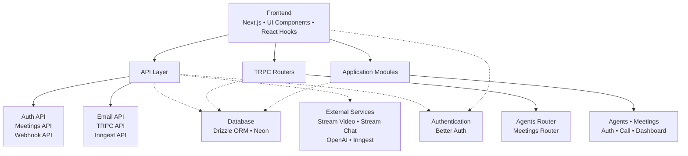
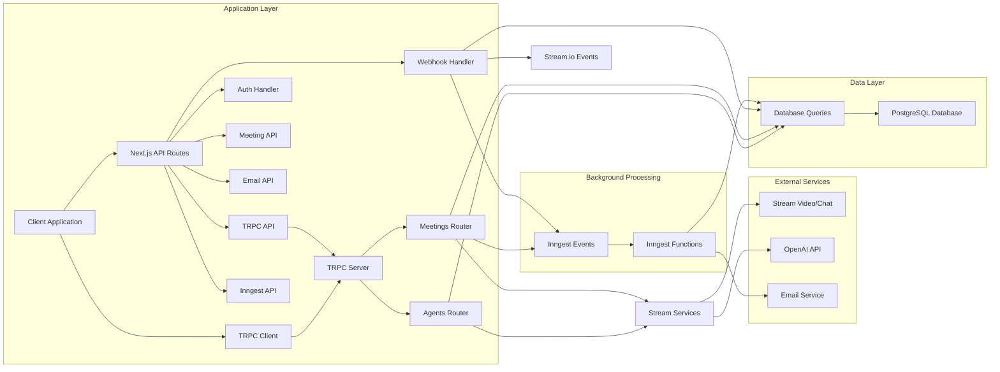

# SMTG Notion - AI Meeting Assistant

SMTG Notion is an AI-powered meeting assistant that facilitates intelligent conversations between users and AI agents. The platform enables users to schedule meetings, participate in real-time video calls with AI agents, and receive automated summaries and follow-ups.

## Project Structure



## Backend Information Flow



## Database Schema

The application uses PostgreSQL with Drizzle ORM for database management. The schema consists of several tables:

### User Management Tables

#### Users Table
```ts
user = pgTable("user", {
    id: text("id").primaryKey(),
    name: text("name").notNull(),
    email: text("email").notNull().unique(),
    emailVerified: boolean("email_verified").$defaultFn(() => false).notNull(),
    image: text("image"),
    createdAt: timestamp("created_at").$defaultFn(() => new Date()).notNull(),
    updatedAt: timestamp("updated_at").$defaultFn(() => new Date()).notNull(),
});
```

#### Sessions Table
```ts
session = pgTable("session", {
    id: text("id").primaryKey(),
    expiresAt: timestamp("expires_at").notNull(),
    token: text("token").notNull().unique(),
    createdAt: timestamp("created_at").notNull(),
    updatedAt: timestamp("updated_at").notNull(),
    ipAddress: text("ip_address"),
    userAgent: text("user_agent"),
    userId: text("user_id").notNull().references(() => user.id, { onDelete: "cascade" }),
});
```

#### Accounts Table
```ts
account = pgTable("account", {
    id: text("id").primaryKey(),
    accountId: text("account_id").notNull(),
    providerId: text("provider_id").notNull(),
    userId: text("user_id").notNull().references(() => user.id, { onDelete: "cascade" }),
    accessToken: text("access_token"),
    refreshToken: text("refresh_token"),
    idToken: text("id_token"),
    accessTokenExpiresAt: timestamp("access_token_expires_at"),
    refreshTokenExpiresAt: timestamp("refresh_token_expires_at"),
    scope: text("scope"),
    password: text("password"),
    createdAt: timestamp("created_at").notNull(),
    updatedAt: timestamp("updated_at").notNull(),
});
```

#### Verification Table
```ts
verification = pgTable("verification", {
    id: text("id").primaryKey(),
    identifier: text("identifier").notNull(),
    value: text("value").notNull(),
    expiresAt: timestamp("expires_at").notNull(),
    createdAt: timestamp("created_at").$defaultFn(() => new Date()),
    updatedAt: timestamp("updated_at").$defaultFn(() => new Date()),
});
```

### Application Tables

#### Agents Table
```ts
agents = pgTable("agents", {
    id: text("id").primaryKey().$defaultFn(() => nanoid()),
    name: text("name").notNull(),
    userId: text("user_id").notNull().references(() => user.id, { onDelete: "cascade" }),
    instructions: text("instructions").notNull(),
    githubRepo: text("github_repo"),
    createdAt: timestamp("created_at").notNull().defaultNow(),
    updatedAt: timestamp("updated_at").notNull().defaultNow(),
});
```

#### Meetings Table
```ts
meetingStatus = pgEnum("meeting_status", [
    "upcoming",
    "active",
    "completed",
    "processing",
    "cancelled",
]);

meetings = pgTable("meetings", {
    id: text("id").primaryKey().$defaultFn(() => nanoid()),
    name: text("name").notNull(),
    userId: text("user_id").notNull().references(() => user.id, { onDelete: "cascade" }),
    agentId: text("agent_id").notNull().references(() => agents.id, { onDelete: "cascade" }),
    status: meetingStatus("status").notNull().default("upcoming"),
    startedAt: timestamp("started_at"),
    endedAt: timestamp("ended_at"),
    transcriptUrl: text("transcript_url"),
    recordingUrl: text("recording_url"),
    summary: text("summary"),
    createdAt: timestamp("created_at").notNull().defaultNow(),
    updatedAt: timestamp("updated_at").notNull().defaultNow(),
});
```

## TRPC Implementation

The application uses TRPC (TypeScript RPC) for type-safe communication between the frontend and backend. TRPC provides end-to-end typesafety and enables autocompletion for API calls.

### Server Setup

The TRPC server is initialized in `src/trpc/init.ts` with:

1. **Context Creation**: A cached context creation function that provides user session information
2. **Procedure Types**: 
   - `baseProcedure`: Basic procedure without authentication
   - `protectedProcedure`: Procedure that requires authentication
3. **Router Creation**: Function to create TRPC routers
4. **Caller Factory**: Function to create server-side callers

### Client Setup

The TRPC client is configured in `src/trpc/client.tsx` with:

1. **HTTP Batch Link**: For efficient batching of requests
2. **Query Client**: Integration with React Query for caching and state management
3. **Provider Component**: TRPCReactProvider that wraps the application

### Routers

The application has two main routers:

1. **Agents Router** (`src/modules/agents/server/procedures.ts`): Handles all agent-related operations
2. **Meetings Router** (`src/modules/meetings/server/procedures.ts`): Handles all meeting-related operations

These routers are combined in `src/trpc/routers/_app.ts` to create the main application router.

### Procedures

Each router contains queries (for data fetching) and mutations (for data modification):

#### Agents Procedures
- Queries: `getOne`, `getMany`
- Mutations: `create`, `update`, `remove`

#### Meetings Procedures
- Queries: `getOne`, `getMany`, `getTranscript`, `generateToken`, `generateChatToken`
- Mutations: `create`, `update`, `remove`

## API Endpoints

### REST API Endpoints

#### Authentication API
- `POST /api/auth/[...all]` - Authentication handler for sign-in/sign-up
- `GET /api/auth/[...all]` - Authentication handler for OAuth callbacks

#### Meetings API
- `GET /api/meetings/[meetingId]` - Fetch meeting details by ID
  - Returns meeting information if the meeting is active or upcoming
  - Returns 404 if meeting not found
  - Returns 400 if meeting is not available for joining

#### Webhook API
- `POST /api/webhook` - Handle Stream.io webhooks for real-time events
  - Supports multiple event types:
    - `call.session_started` - Meeting started
    - `call.session_participant_left` - Participant left meeting
    - `call.session_ended` - Meeting ended
    - `call.transcription_ready` - Transcription available
    - `call.recording_ready` - Recording available
    - `message.new` - New chat message

#### Email API
- `POST /api/send-summary-email` - Send meeting summary via email
  - Requires: `to`, `meetingName`, `summary`
  - Optional: `agentName`, `date`, `duration`

#### TRPC API
- `POST /api/trpc/[trpc]` - TRPC endpoint for type-safe API calls
- `GET /api/trpc/[trpc]` - TRPC endpoint for queries

#### Inngest API
- `POST /api/inngest` - Inngest event handler
- `GET /api/inngest` - Inngest introspection endpoint
- `PUT /api/inngest` - Inngest event handler

### TRPC Procedures

#### Agents Router

##### Queries
- `agents.getOne({ id })` - Get agent by ID
- `agents.getMany({ page, pageSize, search })` - Get paginated list of agents

##### Mutations
- `agents.create(input)` - Create a new agent
- `agents.update(input)` - Update an existing agent
- `agents.remove({ id })` - Delete an agent

#### Meetings Router

##### Queries
- `meetings.getOne({ id })` - Get meeting by ID with agent details
- `meetings.getMany({ page, pageSize, search, agentId, status })` - Get paginated list of meetings
- `meetings.getTranscript({ id })` - Get meeting transcript with speaker information
- `meetings.generateToken()` - Generate Stream Video token
- `meetings.generateChatToken()` - Generate Stream Chat token

##### Mutations
- `meetings.create(input)` - Create a new meeting
- `meetings.update(input)` - Update an existing meeting
- `meetings.remove({ id })` - Delete a meeting

## Detailed Documentation

The application includes comprehensive documentation covering all major components:

### Core Documentation
- [Database Schema](./docs/database.md) - Complete database structure and relationships
- [TRPC Implementation](./docs/trpc.md) - Type-safe API communication setup

### Module Documentation
- [Agents Module](./docs/agents.md) - AI agent management
- [Meetings Module](./docs/meetings.md) - Meeting lifecycle management
- [Authentication Module](./docs/auth.md) - User authentication and authorization
- [Call Module](./docs/call.md) - Real-time video call interface
- [Dashboard Module](./docs/dashboard.md) - Main dashboard interface
- [Home Module](./docs/home.md) - Landing page and overview

For a complete overview of all documentation, see [Documentation Summary](./docs/SUMMARY.md).

## External Services Integration

### Stream Video & Chat
Integration with Stream's real-time communication platform for video calls and messaging.

### OpenAI
Used for real-time transcription processing and intelligent chat responses.

### Inngest
Serverless event-driven architecture for background processing tasks.

### Neon Database
PostgreSQL database managed with Drizzle ORM for data persistence.

## Development

### Prerequisites
- Node.js 18+
- PostgreSQL database (Neon recommended)
- Stream.io account
- OpenAI API key
- Inngest account

### Setup
1. Clone the repository
2. Install dependencies: `npm install`
3. Set up environment variables (see `.env.example`)
4. Run database migrations: `npm run db:push`
5. Start development server: `npm run dev`

### Available Scripts
- `npm run dev` - Start development server
- `npm run build` - Build for production
- `npm run start` - Start production server
- `npm run lint` - Run ESLint
- `npm run db:push` - Push database schema changes
- `npm run db:studio` - Open Drizzle Studio
- `npm run dev:webhook` - Start ngrok tunnel for webhook testing
