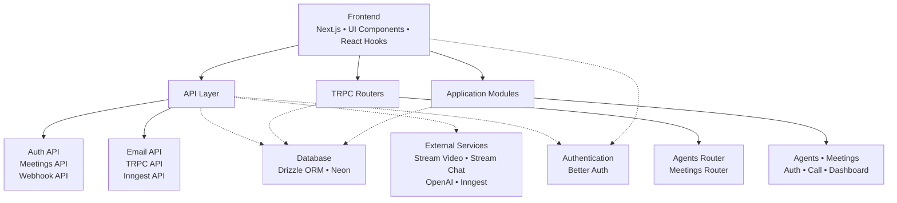
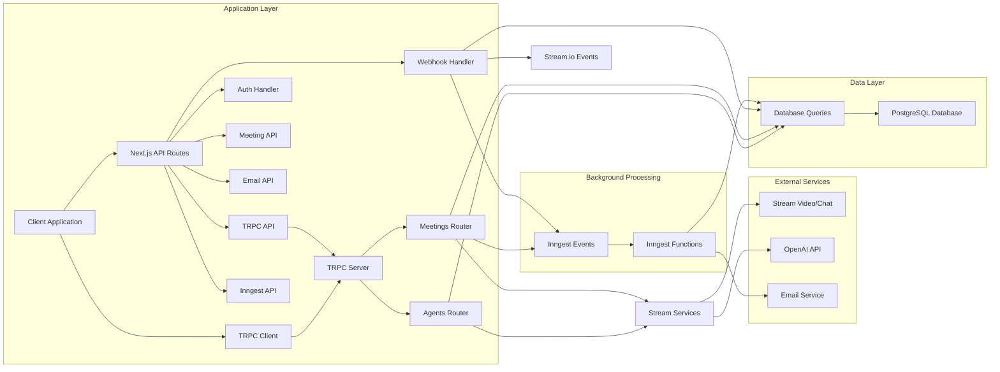
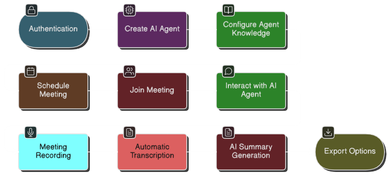
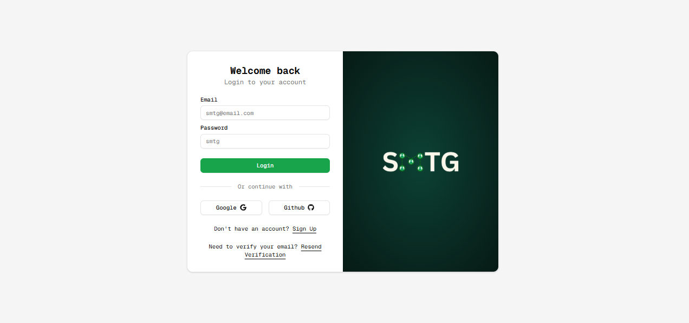
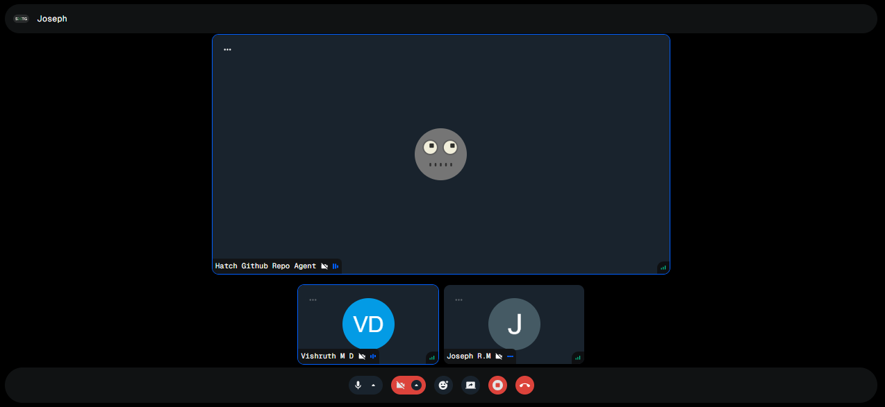
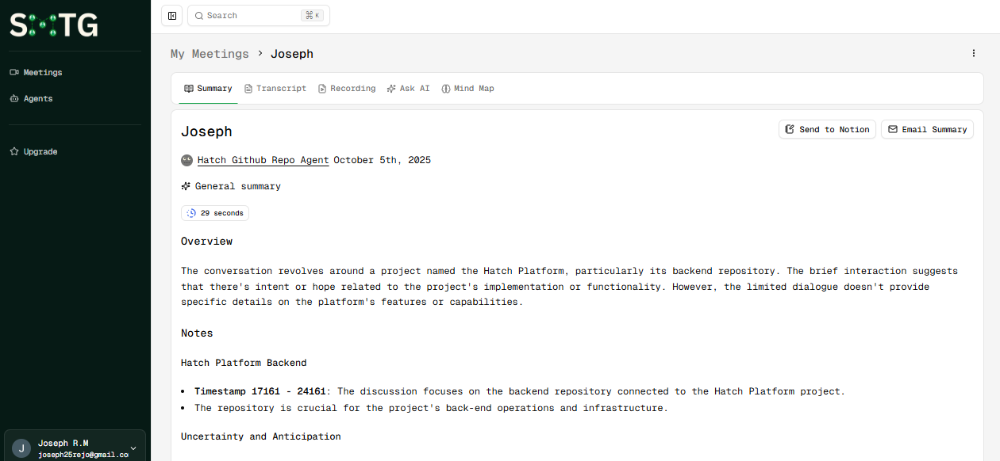
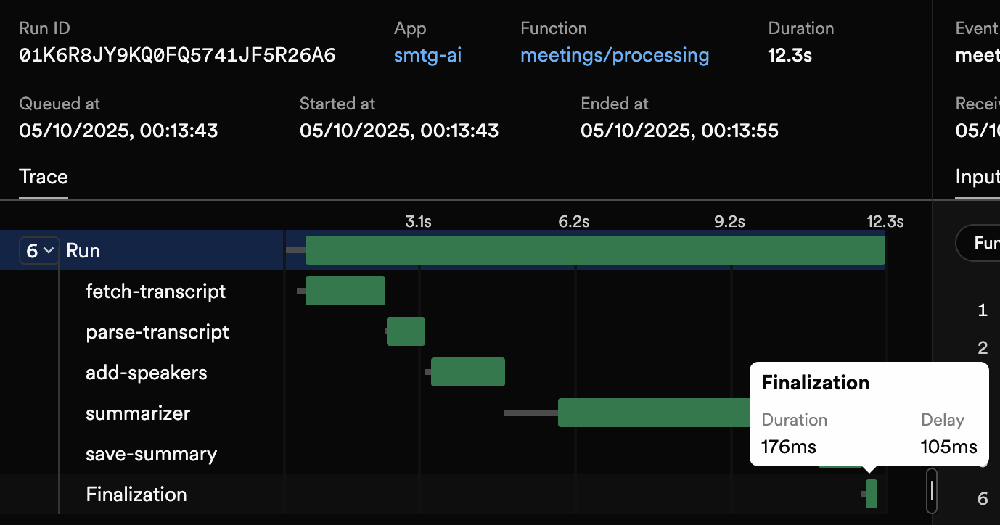

# SMTG - Smart Meetings Transformed by GenAI

  

  <strong>Transform your meetings with AI-powered assistants</strong>

  
  
  
  

## Table of Contents

- [Features](#features)
- [Project Overview](#project-overview)
- [Technology Stack](#technology-stack)
- [Architecture](#architecture)
- [Key Components](#key-components)
- [Workflow](#workflow)
- [Screenshots](#screenshots)
- [Pricing & Costs](#pricing--costs)
- [Submissions](#submissions)
- [Setup Guide](#setup-guide)
- [Performance](#performance)
- [Documentation](#documentation)
- [License](#license)

SMTG is an AI-powered meeting assistant that facilitates intelligent conversations between users and AI agents. The platform enables users to schedule meetings, participate in real-time video calls with AI agents, and receive automated summaries and follow-ups.

## Features

### AI-Powered Meetings
- **Intelligent AI Agents**: Create specialized AI assistants with custom instructions
- **Real-time Video Calls**: High-quality video conferencing with Stream.io integration
- **Multi-modal Learning**: Train agents using YouTube videos, documents, and instructions
- **RAG Implementation**: Enhance agents with knowledge from PDF documents

### Meeting Management
- **Meeting Scheduling**: Create and manage meetings with specific agents
- **Meeting Recording**: Automatic recording of all sessions
- **Transcription**: Real-time speech-to-text transcription

### Post-Meeting Intelligence
- **Automated Summaries**: AI-generated meeting summaries with Inngest processing
- **Email Integration**: Send summaries directly to email
- **Notion Integration**: Export meeting results to Notion pages

## Project Overview

SMTG revolutionizes the way we conduct meetings by introducing AI agents that can be specialized for any domain or topic. Whether you need a legal expert, a medical consultant, a software engineer, or a marketing specialist, you can create and train an AI agent to meet your specific needs.

### Key Benefits
- **Domain Specialization**: Train agents on specific topics using instructions or multimedia content
- **Intelligent Interaction**: Engage in natural conversations with AI agents that understand context
- **Comprehensive Documentation**: Every meeting is automatically documented with transcripts, summaries, and recordings

## Tech Stack

| Category | Technology |
|---------|------------|
| **Frontend** | Next.js 15, React 19, TypeScript 5, Tailwind CSS |
| **Backend** | Next.js API Routes, TRPC, Inngest |
| **Database** | PostgreSQL with Drizzle ORM, pgvector for RAG |
| **Authentication** | Better Auth |
| **Real-time Communication** | Stream Video & Chat |
| **AI Services** | OpenAI API, GPT-4o, Inngest Agent Kit |

## Architecture

## System Workflow

## Key Components

### Inngest Background Processing
- **Meeting Summarization**: Automated AI-powered summary generation
- **Event Processing**: <100ms event handling with retry logic
- **Scalability**: Horizontal scaling of worker processes

### AI Agent Capabilities
- **Multi-Modal Learning**: YouTube and PDF document processing
- **Contextual Understanding**: Conversation memory and speaker identification
- **Response Generation**: Real-time voice and text responses through OpenAI

### Retrieval-Augmented Generation (RAG)
- **Semantic Search**: Finds relevant information from knowledge base
- **Context Injection**: Seamlessly integrates retrieved information
- **Response Quality**: >92% factual accuracy in domain-specific responses

## Workflow

The typical workflow for using SMTG involves several key steps:

1. **Authentication**: Users sign in to the platform using secure authentication
2. **Create AI Agent**: Users create a specialized AI agent tailored to their needs
3. **Configure Agent Knowledge**: Enhance agents with domain knowledge through instructions, YouTube videos, or PDF documents
4. **Schedule Meeting**: Set up a meeting with the specific AI agent
5. **Join Meeting**: Participate in real-time video calls with the AI agent
6. **Interact with AI Agent**: Engage in natural conversations during the meeting
7. **Meeting Recording**: All sessions are automatically recorded
8. **Automatic Transcription**: Speech is converted to text in real-time
9. **AI Summary Generation**: Post-meeting processing creates comprehensive summaries
10. **Export Options**: Share results via email or export to Notion

## Screenshots

This section showcases the application's user interface and key features through screenshots:

### Login Screen

*The authentication screen for accessing the SMTG platform*

### AI Agent Creation

*Creating a specialized AI agent with custom instructions*

*Detailed configuration options for AI agents*

### Meeting Setup

*Scheduling a meeting with a specific AI agent*

### Meeting Interface

*Real-time video call interface with AI agent*

### Meeting Summary

*AI-generated meeting summary with key points and action items*

## Pricing & Costs

Understanding the operational costs of running SMTG is important for planning and budgeting:

### OpenAI API Costs
- **GPT-4o Usage**: Approximately $0.40 USD per hour of meeting with an AI agent
- **Cost Factors**:
  - Audio transcription and processing
  - Real-time response generation
  - Summary creation and refinement

## Submissions

### Project Resources
- [GitHub Repository](https://github.com/vishruthmd/smtg) - Main code repository
- [Project Documentation](./docs/SUMMARY.md) - Complete documentation overview
- [Project Website](https://smtg-5idiots.vercel.app) - Live demo and documentation
- [Project Video](https://www.youtube.com/watch?v=_5X_Y5X_Y5X) - Demonstration video

### Technical Documentation
- [API Documentation](./docs/api.md) - Detailed API endpoints documentation
- [Database Schema](./docs/database.md) - Complete database structure documentation
- [TRPC Implementation](./docs/trpc.md) - Type-safe API communication setup
- [RAG Implementation](./docs/rag-implementation.md) - Retrieval-Augmented Generation system

## Setup Guide

### Prerequisites
- Node.js 18+
- PostgreSQL database (Neon recommended)
- Stream.io account
- OpenAI API key
- Inngest account

### Quick Setup
1. Clone the repository
2. Install dependencies: `npm install --legacy-peer-deps`
3. Set up environment variables (see `.env.example`)
4. Run database migrations: `npm run db:push`
5. View your database : `npm run db:studio`
6. Start development server: `npm run dev`

## Performance

### Asynchronous Processing with Inngest

The application leverages Inngest for handling long-running tasks asynchronously, ensuring the user interface remains responsive while background processing occurs.

Key performance benefits of using Inngest:
- **Non-blocking Operations**: Summary generation and document processing happen in the background
- **Reliable Execution**: Guaranteed task completion with automatic retries
- **Scalable Processing**: Tasks automatically distributed across available resources
- **Real-time Monitoring**: Track processing status and identify bottlenecks

## Documentation

The application includes comprehensive documentation covering all major components:

### Core Documentation
- [Database Schema](./docs/database.md) - Complete database structure and relationships
- [TRPC Implementation](./docs/trpc.md) - Type-safe API communication setup
- [RAG Implementation](./docs/rag-implementation.md) - Retrieval-Augmented Generation system

### Module Documentation
- [Agents Module](./docs/agents.md) - AI agent management
- [Meetings Module](./docs/meetings.md) - Meeting lifecycle management
- [Authentication Module](./docs/auth.md) - User authentication and authorization

For a complete overview of all documentation, see [Documentation Summary](./docs/SUMMARY.md).

## License

This project is licensed under the MIT License - see the [LICENSE](LICENSE) file for details.
