# SMTG - AI Meeting Assistant

<p align="center">
  
</p>

<p align="center">
  <strong>Transform your meetings with AI-powered assistants</strong>
</p>

<p align="center">
  
  
  
  
</p>

## 📚 Table of Contents

- [Features](#-features)
- [Project Structure](#project-structure)
- [Backend Information Flow](#backend-information-flow)
- [Database Schema](#database-schema)
- [TRPC Implementation](#trpc-implementation)
- [API Endpoints](#api-endpoints)
- [Detailed Documentation](#detailed-documentation)
- [External Services Integration](#external-services-integration)
- [Development](#development)
- [Getting Started](#-getting-started)
- [Workflow](#-workflow)

SMTG is an AI-powered meeting assistant that facilitates intelligent conversations between users and AI agents. The platform enables users to schedule meetings, participate in real-time video calls with AI agents, and receive automated summaries and follow-ups.

## 🌟 Features

<details>
<summary>Click to expand feature list</summary>

### AI-Powered Meetings
- **Intelligent AI Agents**: Create specialized AI assistants with custom instructions
- **Real-time Video Calls**: High-quality video conferencing with Stream.io integration
- **Multi-modal Learning**: Train agents using YouTube videos, documents, and instructions

### Comprehensive Meeting Management
- **Meeting Scheduling**: Create and manage meetings with specific agents
- **Specialized Agents**: Customize agents with domain-specific knowledge
- **Meeting Recording**: Automatic recording of all sessions
- **Transcription**: Real-time speech-to-text transcription

### Post-Meeting Intelligence
- **Automated Summaries**: AI-generated meeting summaries
- **Actionable Insights**: Key takeaways and action items
- **Email Integration**: Send summaries directly to email or Notion
- **Interactive Q&A**: Ask questions about past meetings
- **Knowledge Mindmaps**: Visual representation of meeting content
- **Persistent Storage**: All meetings stored for future reference

### Authentication & Security
- **Multiple Auth Options**: Google, GitHub, or email/password authentication
- **Secure Sessions**: Industry-standard security practices
- **Data Privacy**: End-to-end encryption for sensitive information

### Developer Experience
- **Type-safe API**: TRPC integration for reliable communication
- **Modern Stack**: Next.js, React, TypeScript, and PostgreSQL
- **Extensible Architecture**: Modular design for easy customization

</details>

## 🎯 Project Overview

SMTG revolutionizes the way we conduct meetings by introducing AI agents that can be specialized for any domain or topic. Whether you need a legal expert, a medical consultant, a software engineer, or a marketing specialist, you can create and train an AI agent to meet your specific needs.

### Key Benefits

- **Domain Specialization**: Train agents on specific topics using instructions or multimedia content
- **Intelligent Interaction**: Engage in natural conversations with AI agents that understand context
- **Comprehensive Documentation**: Every meeting is automatically documented with transcripts, summaries, and recordings
- **Seamless Integration**: Export meeting results directly to email or Notion
- **Knowledge Retention**: Access past meetings and continue conversations with AI

### Use Cases

- **Business Meetings**: Conduct strategy sessions with specialized business advisors
- **Educational Sessions**: Learn from AI tutors trained on specific subjects
- **Healthcare Consultations**: Interact with medical AI assistants (for informational purposes)
- **Legal Advice**: Discuss legal matters with AI trained on legal principles
- **Technical Support**: Get help from AI specialists in programming, engineering, or IT

## Project Structure

```mermaid
graph TD
    A[Frontend<br/>Next.js • UI Components • React Hooks] 
    
    A --> B[API Layer]
    B --> C[Auth API<br/>Meetings API<br/>Webhook API]
    B --> D[Email API<br/>TRPC API<br/>Inngest API]
    
    A --> E[TRPC Routers]
    E --> F[Agents Router<br/>Meetings Router]
    
    A --> G[Application Modules]
    G --> H[Agents • Meetings<br/>Auth • Call • Dashboard]
    
    I[Database<br/>Drizzle ORM • Neon]
    J[External Services<br/>Stream Video • Stream Chat<br/>OpenAI • Inngest]
    K[Authentication<br/>Better Auth]
    
    %% Connections
    B -.-> I
    B -.-> J
    B -.-> K
    E -.-> I
    G -.-> I
    A -.-> K
```



## Backend Information Flow


## Database Schema

The application uses PostgreSQL with Drizzle ORM for database management. The schema consists of several tables:

### User Management Tables

#### Users Table
```ts
user = pgTable("user", {
    id: text("id").primaryKey(),
    name: text("name").notNull(),
    email: text("email").notNull().unique(),
    emailVerified: boolean("email_verified").$defaultFn(() => false).notNull(),
    image: text("image"),
    createdAt: timestamp("created_at").$defaultFn(() => new Date()).notNull(),
    updatedAt: timestamp("updated_at").$defaultFn(() => new Date()).notNull(),
});
```

#### Sessions Table
```ts
session = pgTable("session", {
    id: text("id").primaryKey(),
    expiresAt: timestamp("expires_at").notNull(),
    token: text("token").notNull().unique(),
    createdAt: timestamp("created_at").notNull(),
    updatedAt: timestamp("updated_at").notNull(),
    ipAddress: text("ip_address"),
    userAgent: text("user_agent"),
    userId: text("user_id").notNull().references(() => user.id, { onDelete: "cascade" }),
});
```

#### Accounts Table
```ts
account = pgTable("account", {
    id: text("id").primaryKey(),
    accountId: text("account_id").notNull(),
    providerId: text("provider_id").notNull(),
    userId: text("user_id").notNull().references(() => user.id, { onDelete: "cascade" }),
    accessToken: text("access_token"),
    refreshToken: text("refresh_token"),
    idToken: text("id_token"),
    accessTokenExpiresAt: timestamp("access_token_expires_at"),
    refreshTokenExpiresAt: timestamp("refresh_token_expires_at"),
    scope: text("scope"),
    password: text("password"),
    createdAt: timestamp("created_at").notNull(),
    updatedAt: timestamp("updated_at").notNull(),
});
```

#### Verification Table
```ts
verification = pgTable("verification", {
    id: text("id").primaryKey(),
    identifier: text("identifier").notNull(),
    value: text("value").notNull(),
    expiresAt: timestamp("expires_at").notNull(),
    createdAt: timestamp("created_at").$defaultFn(() => new Date()),
    updatedAt: timestamp("updated_at").$defaultFn(() => new Date()),
});
```

### Application Tables

#### Agents Table
```ts
agents = pgTable("agents", {
    id: text("id").primaryKey().$defaultFn(() => nanoid()),
    name: text("name").notNull(),
    userId: text("user_id").notNull().references(() => user.id, { onDelete: "cascade" }),
    instructions: text("instructions").notNull(),
    githubRepo: text("github_repo"),
    createdAt: timestamp("created_at").notNull().defaultNow(),
    updatedAt: timestamp("updated_at").notNull().defaultNow(),
});
```

#### Meetings Table
```ts
meetingStatus = pgEnum("meeting_status", [
    "upcoming",
    "active",
    "completed",
    "processing",
    "cancelled",
]);

meetings = pgTable("meetings", {
    id: text("id").primaryKey().$defaultFn(() => nanoid()),
    name: text("name").notNull(),
    userId: text("user_id").notNull().references(() => user.id, { onDelete: "cascade" }),
    agentId: text("agent_id").notNull().references(() => agents.id, { onDelete: "cascade" }),
    status: meetingStatus("status").notNull().default("upcoming"),
    startedAt: timestamp("started_at"),
    endedAt: timestamp("ended_at"),
    transcriptUrl: text("transcript_url"),
    recordingUrl: text("recording_url"),
    summary: text("summary"),
    createdAt: timestamp("created_at").notNull().defaultNow(),
    updatedAt: timestamp("updated_at").notNull().defaultNow(),
});
```

## TRPC Implementation

The application uses TRPC (TypeScript RPC) for type-safe communication between the frontend and backend. TRPC provides end-to-end typesafety and enables autocompletion for API calls.

### Server Setup

The TRPC server is initialized in `src/trpc/init.ts` with:

1. **Context Creation**: A cached context creation function that provides user session information
2. **Procedure Types**: 
   - `baseProcedure`: Basic procedure without authentication
   - `protectedProcedure`: Procedure that requires authentication
3. **Router Creation**: Function to create TRPC routers
4. **Caller Factory**: Function to create server-side callers

### Client Setup

The TRPC client is configured in `src/trpc/client.tsx` with:

1. **HTTP Batch Link**: For efficient batching of requests
2. **Query Client**: Integration with React Query for caching and state management
3. **Provider Component**: TRPCReactProvider that wraps the application

### Routers

The application has two main routers:

1. **Agents Router** (`src/modules/agents/server/procedures.ts`): Handles all agent-related operations
2. **Meetings Router** (`src/modules/meetings/server/procedures.ts`): Handles all meeting-related operations

These routers are combined in `src/trpc/routers/_app.ts` to create the main application router.

### Procedures

Each router contains queries (for data fetching) and mutations (for data modification):

#### Agents Procedures
- Queries: `getOne`, `getMany`
- Mutations: `create`, `update`, `remove`

#### Meetings Procedures
- Queries: `getOne`, `getMany`, `getTranscript`, `generateToken`, `generateChatToken`
- Mutations: `create`, `update`, `remove`

## API Endpoints

### REST API Endpoints

#### Authentication API
- `POST /api/auth/[...all]` - Authentication handler for sign-in/sign-up
- `GET /api/auth/[...all]` - Authentication handler for OAuth callbacks

#### Meetings API
- `GET /api/meetings/[meetingId]` - Fetch meeting details by ID
  - Returns meeting information if the meeting is active or upcoming
  - Returns 404 if meeting not found
  - Returns 400 if meeting is not available for joining

#### Webhook API
- `POST /api/webhook` - Handle Stream.io webhooks for real-time events
  - Supports multiple event types:
    - `call.session_started` - Meeting started
    - `call.session_participant_left` - Participant left meeting
    - `call.session_ended` - Meeting ended
    - `call.transcription_ready` - Transcription available
    - `call.recording_ready` - Recording available
    - `message.new` - New chat message

#### Email API
- `POST /api/send-summary-email` - Send meeting summary via email
  - Requires: `to`, `meetingName`, `summary`
  - Optional: `agentName`, `date`, `duration`

#### TRPC API
- `POST /api/trpc/[trpc]` - TRPC endpoint for type-safe API calls
- `GET /api/trpc/[trpc]` - TRPC endpoint for queries

#### Inngest API
- `POST /api/inngest` - Inngest event handler
- `GET /api/inngest` - Inngest introspection endpoint
- `PUT /api/inngest` - Inngest event handler

### TRPC Procedures

#### Agents Router

##### Queries
- `agents.getOne({ id })` - Get agent by ID
- `agents.getMany({ page, pageSize, search })` - Get paginated list of agents

##### Mutations
- `agents.create(input)` - Create a new agent
- `agents.update(input)` - Update an existing agent
- `agents.remove({ id })` - Delete an agent

#### Meetings Router

##### Queries
- `meetings.getOne({ id })` - Get meeting by ID with agent details
- `meetings.getMany({ page, pageSize, search, agentId, status })` - Get paginated list of meetings
- `meetings.getTranscript({ id })` - Get meeting transcript with speaker information
- `meetings.generateToken()` - Generate Stream Video token
- `meetings.generateChatToken()` - Generate Stream Chat token

##### Mutations
- `meetings.create(input)` - Create a new meeting
- `meetings.update(input)` - Update an existing meeting
- `meetings.remove({ id })` - Delete a meeting

## Detailed Documentation

The application includes comprehensive documentation covering all major components:

### Core Documentation
- [Database Schema](./docs/database.md) - Complete database structure and relationships
- [TRPC Implementation](./docs/trpc.md) - Type-safe API communication setup

### Module Documentation
- [Agents Module](./docs/agents.md) - AI agent management
- [Meetings Module](./docs/meetings.md) - Meeting lifecycle management
- [Authentication Module](./docs/auth.md) - User authentication and authorization
- [Call Module](./docs/call.md) - Real-time video call interface
- [Dashboard Module](./docs/dashboard.md) - Main dashboard interface
- [Home Module](./docs/home.md) - Landing page and overview

For a complete overview of all documentation, see [Documentation Summary](./docs/SUMMARY.md).

## External Services Integration

### Stream Video & Chat
Integration with Stream's real-time communication platform for video calls and messaging.

### OpenAI
Used for real-time transcription processing and intelligent chat responses.

### Inngest
Serverless event-driven architecture for background processing tasks.

### Neon Database
PostgreSQL database managed with Drizzle ORM for data persistence.

## 🛠️ Development

### Prerequisites
- Node.js 18+
- PostgreSQL database (Neon recommended)
- Stream.io account
- OpenAI API key
- Inngest account

### Quick Setup
1. Clone the repository
2. Install dependencies: `npm install`
3. Set up environment variables (see `.env.example`)
4. Run database migrations: `npm run db:push`
5. Start development server: `npm run dev`

### Available Scripts
| Script | Description |
|--------|-------------|
| `npm run dev` | Start development server with hot reloading |
| `npm run build` | Build the application for production |
| `npm run start` | Start production server |
| `npm run lint` | Run ESLint to check for code issues |
| `npm run db:push` | Push database schema changes to your database |
| `npm run db:studio` | Open Drizzle Studio for database management |
| `npm run dev:webhook` | Start ngrok tunnel for webhook testing |

### Environment Variables
Create a `.env` file based on `.env.example` with the following required variables:
- `DATABASE_URL` - PostgreSQL database connection string
- `NEXT_PUBLIC_APP_URL` - Your application URL
- `AUTH_SECRET` - Secret for authentication
- `AUTH_GITHUB_ID` & `AUTH_GITHUB_SECRET` - GitHub OAuth credentials
- `AUTH_GOOGLE_ID` & `AUTH_GOOGLE_SECRET` - Google OAuth credentials
- `STREAM_API_KEY` & `STREAM_API_SECRET` - Stream.io credentials
- `OPENAI_API_KEY` - OpenAI API key
- `INNGEST_SIGNING_KEY` & `INNGEST_EVENT_KEY` - Inngest credentials

## 🚀 Getting Started

1. **Sign Up/Sign In**: Create an account using Google, GitHub, or email/password
2. **Create Your First Agent**: Customize an AI agent with specific instructions
3. **Train Your Agent**: Enhance agent knowledge with YouTube videos or documents
4. **Schedule a Meeting**: Set up a meeting with your specialized AI agent
5. **Conduct Your Meeting**: Participate in real-time video calls
6. **Review Results**: Access summaries, transcripts, and recordings
7. **Take Action**: Send results to email/Notion or ask follow-up questions

## 🔄 Workflow

### 1. Authentication
- Sign in using Google Auth, GitHub Auth, or email/password
- Secure session management with Better Auth

### 2. Agent Creation
- Navigate to the Agents section
- Create a new agent with a name and detailed instructions
- Optionally, enhance the agent by adding a YouTube video for domain specialization
- Save the agent for future meetings

### 3. Meeting Setup
- Go to the Meetings section
- Create a new meeting by selecting your specialized agent
- Schedule the meeting for a specific time or start immediately
- Receive a shareable meeting link

### 4. Meeting Execution
- Join the meeting via the provided link
- Participate in real-time video call with your AI agent
- Engage in intelligent conversation based on the agent's specialization
- Benefit from real-time transcription

### 5. Post-Meeting Processing
- Automatic meeting recording
- AI-generated transcript with speaker identification
- Intelligent summary with key points and action items
- Mindmap visualization of meeting content

### 6. Results & Actions
- **Email/Notion Integration**: Send summaries directly to your preferred platform
- **Transcript Access**: Review detailed conversation records
- **Recording Playback**: Watch the meeting recording
- **Interactive Q&A**: Ask questions about the meeting content
- **Persistent Storage**: All data stored for future reference

### 7. Future Reference
- Access all past meetings from your dashboard
- Search through transcripts and summaries
- Re-engage with AI for follow-up questions
- Export data to other platforms as needed

## 🙏 Acknowledgments

- Thanks to all the open-source projects that made this possible
- Special recognition to Stream.io, OpenAI, and Inngest for their APIs
- Appreciation to the Next.js and React communities
