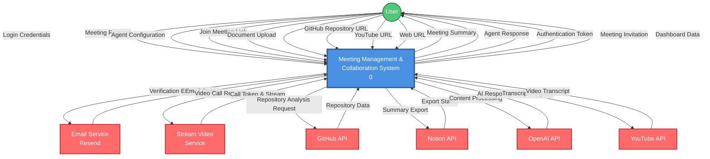
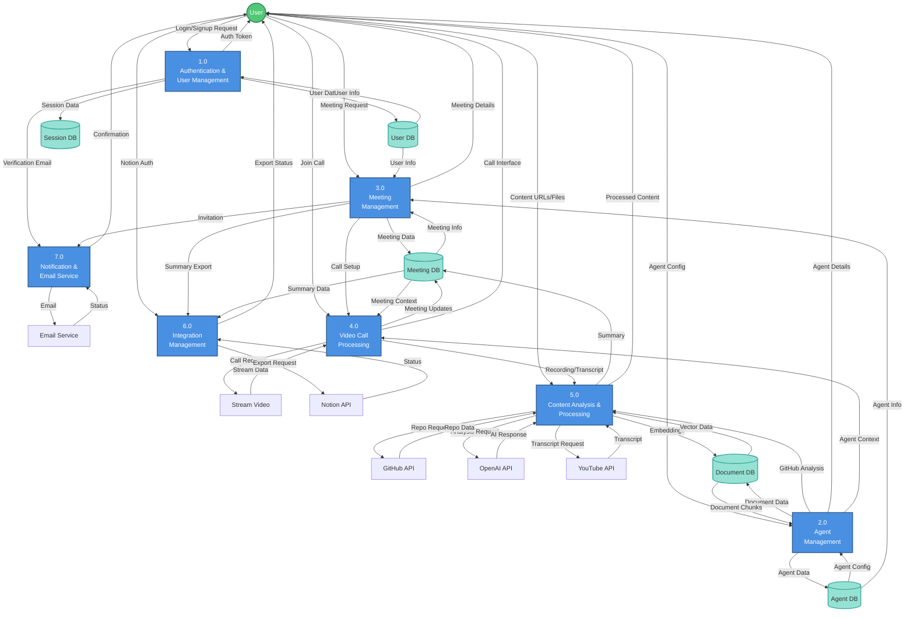
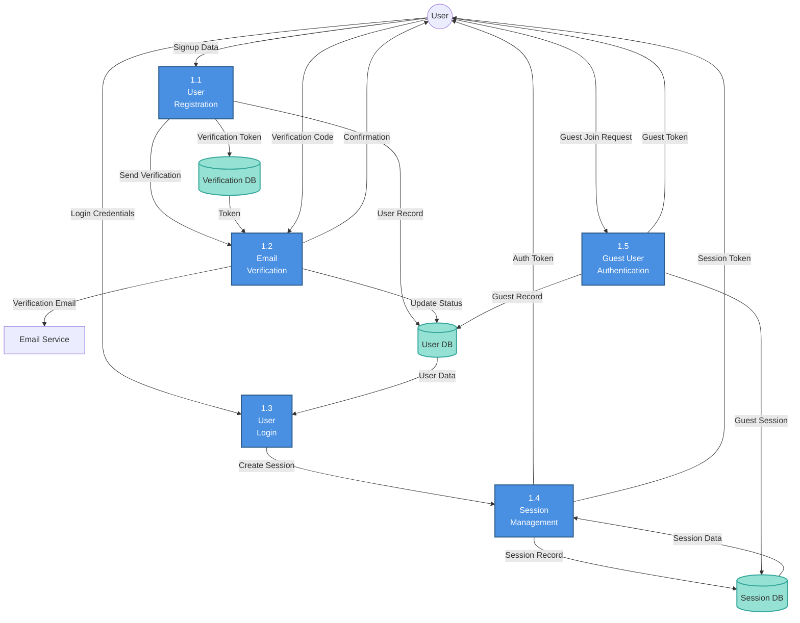
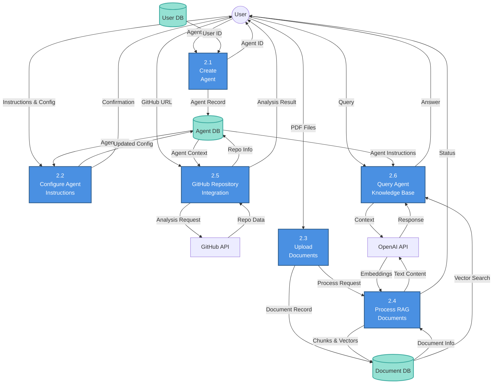
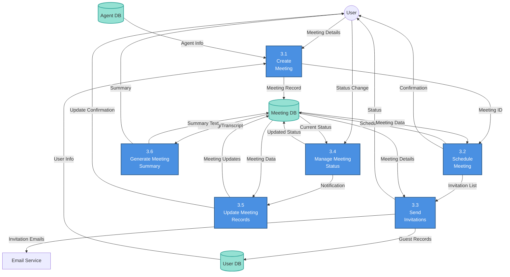
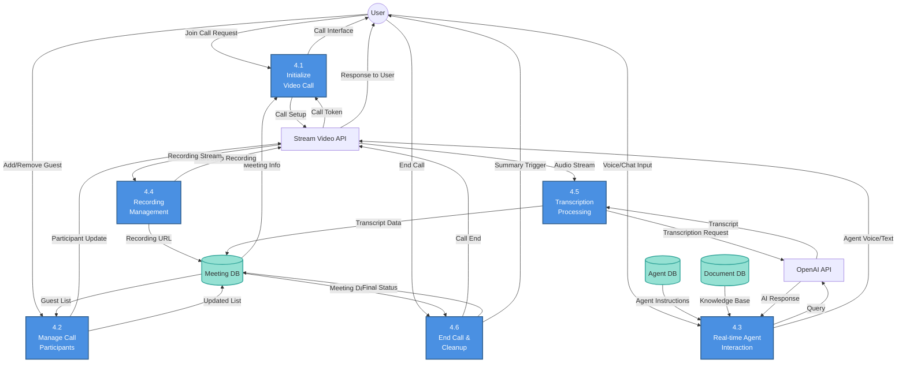
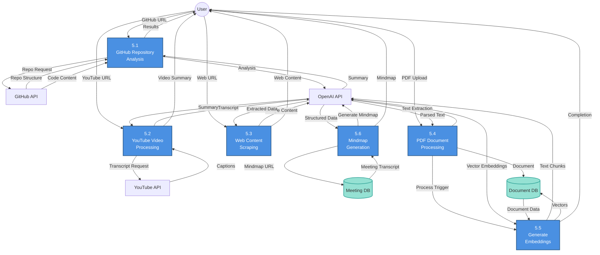
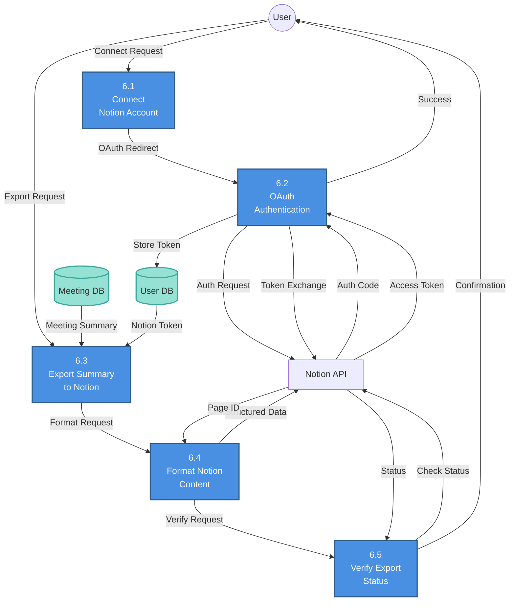
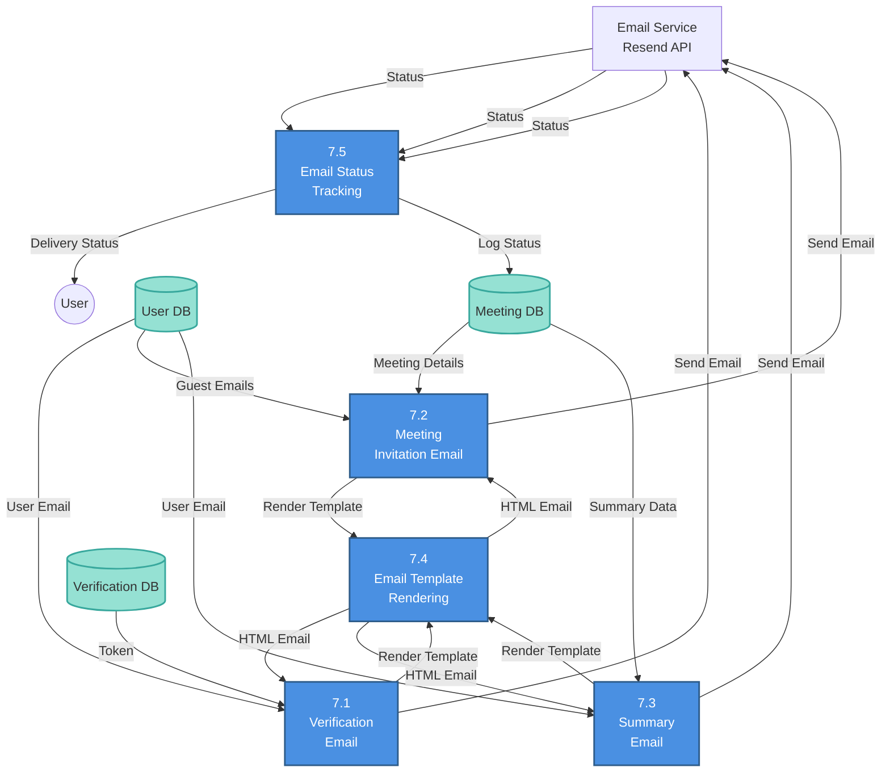

# Data Flow Diagrams (DFD) - Meeting Management & Collaboration System

## Level 0: Context Diagram

The Level 0 DFD shows the system as a single process with external entities and data flows.

### External Entities:

-   **User**: End users (authenticated and guest users)
-   **Email Service**: Resend API for email verification and notifications
-   **Stream Video Service**: Real-time video/audio communication
-   **GitHub API**: Repository analysis and code data
-   **Notion API**: Export meeting summaries to Notion workspace
-   **OpenAI API**: AI-powered processing (embeddings, chat, analysis)
-   **YouTube API**: Video transcript extraction

---

## Level 1: Major Process Decomposition

The Level 1 DFD breaks down the system into major processes and shows data stores.

### Level 1 Processes:

1. **Authentication & User Management** - User registration, login, email verification
2. **Agent Management** - Create, configure, and manage AI agents with custom instructions
3. **Meeting Management** - Schedule, organize, and manage meetings
4. **Video Call Processing** - Handle real-time video calls with recording and transcription
5. **Content Analysis & Processing** - Process documents, GitHub repos, YouTube videos, web content
6. **Integration Management** - Manage third-party integrations (Notion)
7. **Notification & Email Service** - Handle all email communications

### Data Stores:

-   **D1: User DB** - Users, sessions, accounts, verification tokens
-   **D2: Agent DB** - Agent configurations and instructions
-   **D3: Meeting DB** - Meeting details, summaries, recordings
-   **D4: Document DB** - Documents, chunks, embeddings (RAG)
-   **D5: Session DB** - Active user sessions and tokens

---

## Level 2: Detailed Process Decomposition

### Level 2.1: Authentication & User Management (Process 1.0)

**Sub-processes:**

-   **1.1 User Registration**: Create new user accounts with email/password
-   **1.2 Email Verification**: Verify user email addresses via verification codes
-   **1.3 User Login**: Authenticate existing users and validate credentials
-   **1.4 Session Management**: Create, validate, and manage user sessions
-   **1.5 Guest User Authentication**: Temporary authentication for meeting guests

---

### Level 2.2: Agent Management (Process 2.0)

**Sub-processes:**

-   **2.1 Create Agent**: Initialize new AI agent with basic information
-   **2.2 Configure Agent Instructions**: Set custom instructions and behavior
-   **2.3 Upload Documents**: Upload PDF documents for agent knowledge base
-   **2.4 Process RAG Documents**: Extract text, generate embeddings, store chunks
-   **2.5 GitHub Repository Integration**: Analyze and integrate GitHub repository data
-   **2.6 Query Agent Knowledge Base**: Retrieve information using vector similarity search

---

### Level 2.3: Meeting Management (Process 3.0)

**Sub-processes:**

-   **3.1 Create Meeting**: Initialize new meeting with name and agent
-   **3.2 Schedule Meeting**: Set meeting time and parameters
-   **3.3 Send Invitations**: Email invitations to participants
-   **3.4 Manage Meeting Status**: Update status (upcoming, active, completed, cancelled)
-   **3.5 Update Meeting Records**: Maintain meeting information and metadata
-   **3.6 Generate Meeting Summary**: Create AI-powered meeting summaries

---

### Level 2.4: Video Call Processing (Process 4.0)

**Sub-processes:**

-   **4.1 Initialize Video Call**: Set up video call session with Stream API
-   **4.2 Manage Call Participants**: Add/remove guests during the call
-   **4.3 Real-time Agent Interaction**: AI agent participates in conversation using voice/text
-   **4.4 Recording Management**: Record video/audio of the meeting
-   **4.5 Transcription Processing**: Real-time or post-call transcription
-   **4.6 End Call & Cleanup**: Clean up resources and update meeting status

---

### Level 2.5: Content Analysis & Processing (Process 5.0)

**Sub-processes:**

-   **5.1 GitHub Repository Analysis**: Analyze repository structure, code, and documentation
-   **5.2 YouTube Video Processing**: Extract and process video transcripts
-   **5.3 Web Content Scraping**: Scrape and extract data from web URLs
-   **5.4 PDF Document Processing**: Parse and extract text from PDF files
-   **5.5 Generate Embeddings**: Create vector embeddings for semantic search (RAG)
-   **5.6 Mindmap Generation**: Generate visual mindmaps from meeting transcripts

---

### Level 2.6: Integration Management (Process 6.0)

**Sub-processes:**

-   **6.1 Connect Notion Account**: Initiate Notion integration
-   **6.2 OAuth Authentication**: Handle OAuth flow for Notion authorization
-   **6.3 Export Summary to Notion**: Send meeting summary to Notion workspace
-   **6.4 Format Notion Content**: Structure data in Notion's block format
-   **6.5 Verify Export Status**: Confirm successful export to Notion

---

### Level 2.7: Notification & Email Service (Process 7.0)

**Sub-processes:**

-   **7.1 Verification Email**: Send email verification codes to new users
-   **7.2 Meeting Invitation Email**: Send meeting invitations to participants
-   **7.3 Summary Email**: Send meeting summaries via email
-   **7.4 Email Template Rendering**: Format and render HTML email templates
-   **7.5 Email Status Tracking**: Track email delivery status and logs

---

## Summary

### System Overview

This Meeting Management & Collaboration System is a comprehensive platform that enables:

-   **User authentication** with email verification and guest access
-   **AI-powered agents** with custom knowledge bases (RAG) and GitHub integration
-   **Video meetings** with real-time AI agent participation
-   **Content processing** from multiple sources (GitHub, YouTube, PDFs, web)
-   **Third-party integrations** (Notion export)
-   **Automated notifications** via email

### Key Data Flows

1. **User Registration Flow**: User → Registration → Email Verification → Login → Session
2. **Agent Creation Flow**: User → Create Agent → Upload Documents → Process RAG → Query Agent
3. **Meeting Flow**: User → Schedule Meeting → Send Invitations → Video Call → Recording/Transcript → Generate Summary → Export to Notion
4. **Content Analysis Flow**: User → Submit Content URL → Process Content → Generate Summary/Analysis → Return Results

### Technology Stack

-   **Frontend**: Next.js, React, TailwindCSS
-   **Backend**: Next.js API Routes, tRPC
-   **Database**: PostgreSQL with Drizzle ORM
-   **Authentication**: Better Auth
-   **Video**: Stream Video SDK
-   **AI**: OpenAI API (GPT, Embeddings, Whisper)
-   **Background Jobs**: Inngest
-   **Email**: Resend API
-   **Integrations**: GitHub API, YouTube API, Notion API

### Database Schema

-   **Users**: User accounts, sessions, verification tokens
-   **Agents**: AI agent configurations and instructions
-   **Meetings**: Meeting records, status, summaries, recordings
-   **Documents**: PDF documents with vector embeddings for RAG
-   **Guest Users**: Temporary users for meeting participation
