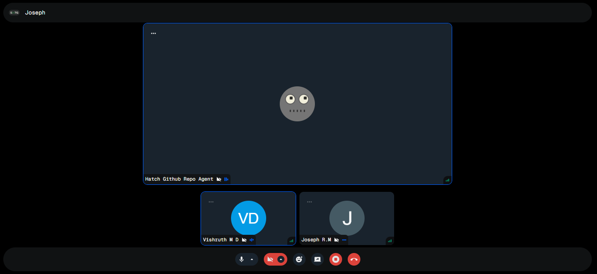

# Meetings Module

The Meetings module manages the complete lifecycle of meetings within the SMTG application. This includes scheduling, creation, real-time video/audio participation, AI agent interaction, automatic transcription, summarization, and follow-up actions. The module integrates with Stream Video SDK for real-time communication and uses Inngest for asynchronous processing.

## Overview

Meetings in SMTG are AI-enhanced video conferences where users can interact with specialized AI agents. Each meeting features automatic transcription, recording, and AI-powered summarization. The module handles the entire workflow from creation to post-meeting analysis.





## Table of Contents

-   [Module Structure](#module-structure)
-   [Database Schema](#database-schema)
-   [Meeting Lifecycle](#meeting-lifecycle)
-   [tRPC API](#trpc-api)
-   [Validation Schemas](#validation-schemas)
-   [Type Definitions](#type-definitions)
-   [Stream Integration](#stream-integration)
-   [Inngest Processing](#inngest-processing)
-   [React Hooks](#react-hooks)
-   [UI Components](#ui-components)
-   [Usage Examples](#usage-examples)

---

## Module Structure

```
src/modules/meetings/
├── hooks/
│   └── use-meetings-filters.ts           # Filter state management hook
├── server/
│   └── procedures.ts                     # tRPC procedures (CRUD + Stream auth)
├── ui/
│   ├── components/
│   │   ├── active-state.tsx              # Active meeting badge/indicator
│   │   ├── agent-id-filter.tsx           # Filter meetings by agent
│   │   ├── cancelled-state.tsx           # Cancelled meeting badge
│   │   ├── chat-provider.tsx             # Stream Chat provider wrapper
│   │   ├── chat-ui.tsx                   # Chat interface component
│   │   ├── columns.tsx                   # Table column definitions
│   │   ├── completed-state.tsx           # Completed meeting badge
│   │   ├── meeting-form.tsx              # Form for creating/editing meetings
│   │   ├── meeting-id-view-header.tsx    # Header for meeting detail view
│   │   ├── meeting-join-link.tsx         # Shareable join link component
│   │   ├── meetings-list-header.tsx      # Header for meetings list
│   │   ├── meetings-search-filter.tsx    # Search input component
│   │   ├── mindmap.tsx                   # Meeting mindmap visualization
│   │   ├── new-meeting-dialog.tsx        # Dialog for creating meetings
│   │   ├── processing-state.tsx          # Processing badge
│   │   ├── status-filter.tsx             # Filter by meeting status
│   │   ├── transcript.tsx                # Transcript display component
│   │   ├── upcoming-state.tsx            # Upcoming meeting badge
│   │   └── update-meeting-dialog.tsx     # Dialog for updating meetings
│   └── views/
│       ├── meeting-id-view.tsx           # Individual meeting detail view
│       └── meetings-view.tsx             # Meetings list view
├── params.ts                              # URL search params configuration
├── schemas.ts                             # Zod validation schemas
└── types.ts                               # TypeScript type definitions
```

---

## Database Schema

### `meetings` Table

| Column          | Type            | Description                    | Constraints                                          |
| --------------- | --------------- | ------------------------------ | ---------------------------------------------------- |
| `id`            | `text`          | Unique meeting identifier      | Primary key, auto-generated (nanoid)                 |
| `name`          | `text`          | Meeting display name           | Required                                             |
| `userId`        | `text`          | Meeting owner's user ID        | Required, foreign key → `user.id` (cascade delete)   |
| `agentId`       | `text`          | Associated AI agent ID         | Required, foreign key → `agents.id` (cascade delete) |
| `status`        | `meetingStatus` | Current meeting status         | Required, default: "upcoming"                        |
| `startedAt`     | `timestamp`     | Meeting start time             | Nullable                                             |
| `endedAt`       | `timestamp`     | Meeting end time               | Nullable                                             |
| `transcriptUrl` | `text`          | URL to transcript file (JSONL) | Nullable                                             |
| `recordingUrl`  | `text`          | URL to video recording         | Nullable                                             |
| `summary`       | `text`          | AI-generated meeting summary   | Nullable                                             |
| `createdAt`     | `timestamp`     | Creation timestamp             | Required, default: now()                             |
| `updatedAt`     | `timestamp`     | Last update timestamp          | Required, default: now()                             |

### `meetingStatus` Enum

Possible values:

-   `"upcoming"` - Scheduled for the future
-   `"active"` - Currently in progress
-   `"completed"` - Finished successfully
-   `"processing"` - Being processed (transcription, summary generation)
-   `"cancelled"` - Cancelled by user

### Related Tables

#### `guestUsers` Table

Stores information about guest participants who join meetings.

| Column      | Type        | Description                                      |
| ----------- | ----------- | ------------------------------------------------ |
| `id`        | `text`      | Guest user identifier (format: "guest-{nanoid}") |
| `name`      | `text`      | Guest's display name                             |
| `meetingId` | `text`      | Associated meeting ID (foreign key)              |
| `userId`    | `text`      | Meeting owner's user ID (foreign key)            |
| `image`     | `text`      | Guest's avatar URL (nullable)                    |
| `createdAt` | `timestamp` | Join timestamp                                   |

---

## Meeting Lifecycle

### 1. **Creation Phase**

-   User creates meeting with name and selected agent
-   Stream Video call is initialized with meeting ID
-   Agent is registered as Stream user with avatar
-   Meeting status: `upcoming`

### 2. **Pre-Meeting Phase**

-   Invitation emails can be sent to participants
-   Join link is generated and shareable
-   Meeting remains in `upcoming` status

### 3. **Active Phase**

-   Meeting status changes to `active` when first participant joins
-   Stream Video handles real-time audio/video
-   Stream Chat provides text messaging
-   Automatic transcription is enabled
-   Automatic recording is enabled (1080p quality)
-   AI agent can participate and respond

### 4. **Completion Phase**

-   Meeting status changes to `completed` when ended
-   Recording and transcript are uploaded to Stream
-   Status changes to `processing`

### 5. **Post-Processing Phase** (Inngest)

-   Transcript is fetched and parsed (JSONL format)
-   Speaker identification and attribution
-   AI summarization using GPT-4o
-   Summary is stored in database
-   Status changes back to `completed`
-   Email notifications sent (optional)

### 6. **Archive Phase**

-   Meeting data remains accessible
-   Transcript and recording available for review
-   Summary and mindmap can be viewed

---

## tRPC API

All procedures are protected and require authentication. Access control varies by meeting status.

### Queries

#### `meetings.getOne`

Fetches a single meeting with agent details and calculated duration.

**Input:**

```typescript
{
    id: string; // Meeting ID
}
```

**Output:**

```typescript
{
    id: string;
    name: string;
    userId: string;
    agentId: string;
    status: MeetingStatus;
    startedAt: Date | null;
    endedAt: Date | null;
    transcriptUrl: string | null;
    recordingUrl: string | null;
    summary: string | null;
    createdAt: Date;
    updatedAt: Date;
    agent: {
        id: string;
        name: string;
        instructions: string;
        githubRepo: string | null;
        userId: string;
        createdAt: Date;
        updatedAt: Date;
    }
    duration: number | null; // Duration in seconds
}
```

**Access Control:**

-   `active`/`upcoming`: Any authenticated user can access
-   `completed`/`cancelled`: Only meeting owner can access
-   `processing`: Only meeting owner can access

**Errors:**

-   `NOT_FOUND` - Meeting doesn't exist
-   `UNAUTHORIZED` - User lacks permission to view meeting

**Example:**

```typescript
const meeting = await trpc.meetings.getOne.query({ id: "meeting-123" });
console.log(`${meeting.name} - Duration: ${meeting.duration}s`);
```

---

#### `meetings.getOneForGuest`

Special endpoint for guest users to access meeting information.

**Input:**

```typescript
{
    id: string; // Meeting ID
}
```

**Output:** Same as `getOne`

**Access Control:**

-   No ownership validation
-   Only checks meeting existence
-   Used for guest join flow

---

#### `meetings.getMany`

Fetches a paginated list of meetings with filtering options.

**Input:**

```typescript
{
  page?: number           // Default: 1
  pageSize?: number       // Default: 10, min: 1, max: 100
  search?: string         // Search by meeting name (case-insensitive)
  agentId?: string        // Filter by specific agent
  status?: MeetingStatus  // Filter by meeting status
}
```

**Output:**

```typescript
{
    items: Array<{
        id: string;
        name: string;
        userId: string;
        agentId: string;
        status: MeetingStatus;
        startedAt: Date | null;
        endedAt: Date | null;
        transcriptUrl: string | null;
        recordingUrl: string | null;
        summary: string | null;
        createdAt: Date;
        updatedAt: Date;
        agent: {
            id: string;
            name: string;
            // ... other agent fields
        };
        duration: number | null;
    }>;
    total: number; // Total count of meetings
    totalPages: number; // Total number of pages
}
```

**Example:**

```typescript
const { items, total } = await trpc.meetings.getMany.query({
    page: 1,
    pageSize: 20,
    search: "sprint",
    status: "completed",
    agentId: "agent-123",
});
```

---

#### `meetings.getTranscript`

Retrieves the meeting transcript with speaker attribution and avatars.

**Input:**

```typescript
{
    id: string; // Meeting ID
}
```

**Output:**

```typescript
Array<{
    speaker_id: string; // ID of the speaker (user/agent/guest)
    type: string; // Transcript item type
    text: string; // Spoken text
    start_ts: number; // Start timestamp (ms)
    stop_ts: number; // End timestamp (ms)
    user: {
        name: string; // Speaker name
        image: string; // Speaker avatar URL
    };
}>;
```

**Process:**

1. Fetches transcript from `transcriptUrl` (JSONL format)
2. Extracts unique speaker IDs
3. Queries database for user, agent, and guest speakers
4. Generates avatars for speakers without images
5. Matches speakers to transcript items

**Example:**

```typescript
const transcript = await trpc.meetings.getTranscript.query({
    id: "meeting-123",
});

transcript.forEach((item) => {
    console.log(`[${item.start_ts}ms] ${item.user.name}: ${item.text}`);
});
```

---

#### `meetings.generateToken`

Generates a Stream Video JWT token for authenticated user.

**Input:** None

**Output:**

```typescript
string; // JWT token for Stream Video
```

**Process:**

1. Upserts user in Stream Video
2. Generates token with 1-hour expiration
3. Returns signed JWT

**Usage:**
Required before joining any Stream Video call.

---

#### `meetings.generateChatToken`

Generates a Stream Chat JWT token for authenticated user.

**Input:** None

**Output:**

```typescript
string; // JWT token for Stream Chat
```

**Process:**

1. Upserts user in Stream Chat with admin role
2. Generates token
3. Returns signed JWT

**Usage:**
Required before using Stream Chat functionality.

### Mutations

#### `meetings.create(input)`

Creates a new meeting and initializes the Stream Video call.

**Input:**
Follows the [meetingsInsertSchema](#schemas).

**Output:**
Returns the created meeting object.

#### `meetings.update(input)`

Updates an existing meeting.

**Input:**
Follows the [meetingsUpdateSchema](#schemas).

**Output:**
Returns the updated meeting object.

---

### Mutations

#### `meetings.create`

Creates a new meeting and initializes Stream Video call.

**Input:**

```typescript
{
    name: string; // Meeting name (required, min 1 char)
    agentId: string; // Agent ID (required, min 1 char)
}
```

**Output:**

```typescript
{
    id: string; // Generated meeting ID
    name: string;
    userId: string; // Automatically set to current user
    agentId: string;
    status: "upcoming"; // Default status
    startedAt: null;
    endedAt: null;
    transcriptUrl: null;
    recordingUrl: null;
    summary: null;
    createdAt: Date;
    updatedAt: Date;
}
```

**Process:**

1. Validates input
2. Creates meeting in database
3. Initializes Stream Video call with:
    - Call type: "default"
    - Call ID: meeting ID
    - Auto-transcription enabled (English)
    - Auto-recording enabled (1080p)
4. Verifies agent exists
5. Registers agent as Stream Video user with avatar

**Example:**

```typescript
const meeting = await trpc.meetings.create.mutate({
    name: "Sprint Planning",
    agentId: "agent-123",
});
// Returns meeting with shareable join link
```

---

#### `meetings.update`

Updates an existing meeting's details.

**Input:**

```typescript
{
    id: string; // Meeting ID (required)
    name: string; // Updated name (required)
    agentId: string; // Updated agent ID (required)
}
```

**Output:**

```typescript
{
    id: string;
    name: string;
    userId: string;
    agentId: string;
    status: MeetingStatus;
    // ... other meeting fields
}
```

**Errors:**

-   `NOT_FOUND` - Meeting doesn't exist or user is not owner

**Example:**

```typescript
const updated = await trpc.meetings.update.mutate({
    id: "meeting-123",
    name: "Updated Sprint Planning",
    agentId: "agent-456",
});
```

---

#### `meetings.remove`

Deletes a meeting and all associated data.

**Input:**

```typescript
{
    id: string; // Meeting ID to delete
}
```

**Output:**

```typescript
{
    id: string;
    name: string;
    // ... deleted meeting data
}
```

**Cascade Effects:**

-   Associated guest users are deleted
-   Stream Video call is not automatically deleted

**Errors:**

-   `NOT_FOUND` - Meeting doesn't exist or user is not owner

---

#### `meetings.sendInvitation`

Sends email invitations to participants with calendar event.

**Input:**

```typescript
{
  meetingId: string            // Meeting ID (required)
  recipientEmails: string[]    // Array of email addresses (required, min 1)
  scheduledDate: string        // ISO date string (required)
  scheduledTime: string        // Time string (required)
  message?: string             // Optional personal message
}
```

**Output:**

```typescript
{
    success: boolean;
    message: string; // e.g., "Invitation sent to 3 recipient(s)"
}
```

**Process:**

1. Validates meeting ownership
2. Fetches meeting and agent details
3. Generates join URL
4. Parses scheduled date/time
5. Sends email to all recipients with:
    - Meeting details
    - Join link
    - Calendar event (iCal format)
    - Organizer information
    - Optional custom message

**Errors:**

-   `NOT_FOUND` - Meeting doesn't exist or unauthorized

**Example:**

```typescript
await trpc.meetings.sendInvitation.mutate({
    meetingId: "meeting-123",
    recipientEmails: ["user1@example.com", "user2@example.com"],
    scheduledDate: "2025-10-15",
    scheduledTime: "14:00",
    message: "Looking forward to discussing the Q4 roadmap!",
});
```

---

## Validation Schemas

### `meetingsInsertSchema`

Zod schema for creating meetings.

```typescript
z.object({
    name: z.string().min(1, { message: "Name is required" }),
    agentId: z.string().min(1, { message: "Agent is required" }),
});
```

### `meetingsUpdateSchema`

Zod schema for updating meetings (extends insert schema with ID).

```typescript
meetingsInsertSchema.extend({
    id: z.string().min(1, { message: "Id is required" }),
});
```

### `sendInvitationSchema`

Zod schema for sending meeting invitations.

```typescript
z.object({
    meetingId: z.string().min(1, { message: "Meeting ID is required" }),
    recipientEmails: z
        .array(z.string().email({ message: "Invalid email address" }))
        .min(1, { message: "At least one recipient email is required" }),
    scheduledDate: z.string().min(1, { message: "Scheduled date is required" }),
    scheduledTime: z.string().min(1, { message: "Scheduled time is required" }),
    message: z.string().optional(),
});
```

---

## Type Definitions

### `MeetingGetOne`

Type-safe representation of a single meeting query result.

```typescript
type MeetingGetOne = inferRouterOutputs<AppRouter>["meetings"]["getOne"];
```

### `MeetingGetMany`

Type-safe representation of paginated meetings list items.

```typescript
type MeetingGetMany =
    inferRouterOutputs<AppRouter>["meetings"]["getMany"]["items"];
```

### `MeetingStatus`

Enum for meeting status values.

```typescript
enum MeetingStatus {
    Upcoming = "upcoming",
    Active = "active",
    Completed = "completed",
    Processing = "processing",
    Cancelled = "cancelled",
}
```

### `StreamTranscriptItem`

Type definition for transcript items from Stream Video.

```typescript
type StreamTranscriptItem = {
    speaker_id: string; // Speaker identifier
    type: string; // Item type (e.g., "transcript")
    text: string; // Spoken text content
    start_ts: number; // Start timestamp in milliseconds
    stop_ts: number; // End timestamp in milliseconds
};
```

---

## Stream Integration

### Stream Video SDK

The module uses [@stream-io/node-sdk](https://www.npmjs.com/package/@stream-io/node-sdk) for real-time video functionality.

**Configuration:**

```typescript
// src/lib/stream-video.ts
import { StreamClient } from "@stream-io/node-sdk";

export const streamVideo = new StreamClient(
    process.env.NEXT_PUBLIC_STREAM_VIDEO_API_KEY!,
    process.env.STREAM_VIDEO_SECRET_KEY!
);
```

**Features Enabled:**

-   **Transcription**: Automatic speech-to-text (English)
-   **Recording**: Automatic recording at 1080p quality
-   **Closed Captions**: Real-time display of transcriptions
-   **User Management**: Automatic user/agent registration

**Call Configuration:**

```typescript
{
  type: "default",
  id: meetingId,
  settings_override: {
    transcription: {
      language: "en",
      mode: "auto-on",
      closed_caption_mode: "auto-on"
    },
    recording: {
      mode: "auto-on",
      quality: "1080p"
    }
  }
}
```

### Stream Chat SDK

Used for text messaging during meetings.

**Features:**

-   Real-time text chat
-   User presence indicators
-   Message history
-   Admin role for meeting creators

---

## Inngest Processing

Inngest handles asynchronous post-meeting processing using AI summarization.

### `meetingsProcessing` Function

**Trigger Event:** `meetings/processing`

**Event Data:**

```typescript
{
    transcriptUrl: string; // URL to transcript JSONL file
    meetingId: string; // Meeting ID
}
```

**Processing Steps:**

1. **Fetch Transcript**

    - Downloads transcript from Stream Video URL
    - Raw JSONL format

2. **Parse Transcript**

    - Parses JSONL to `StreamTranscriptItem[]`
    - Validates structure

3. **Add Speaker Information**

    - Extracts unique speaker IDs
    - Queries database for users and agents
    - Matches speakers to transcript items
    - Handles unknown speakers gracefully

4. **AI Summarization**

    - Uses OpenAI GPT-4o via Inngest Agent Kit
    - System prompt for structured markdown output
    - Generates:
        - Overview section (narrative summary)
        - Notes section (thematic breakdown with timestamps)

5. **Store Results**
    - Saves summary to database
    - Updates meeting status to `completed`

**AI Summarizer Configuration:**

```typescript
const summarizer = createAgent({
    name: "summarizer",
    system: `
    You are an expert summarizer. You write readable, concise, simple content.
    
    Use the following markdown structure:
    
    ### Overview
    Detailed, engaging summary focusing on major features, workflows, and takeaways.
    
    ### Notes
    Thematic sections with timestamp ranges and bullet points.
  `,
    model: openai({
        model: "gpt-4o",
        apiKey: process.env.OPENAI_API_KEY,
    }),
});
```

---

## React Hooks

### `useMeetingsFilters`

Hook for managing URL search parameters for meetings list filtering.

**Returns:**

```typescript
[
  filters: {
    search: string            // Search query (default: "")
    page: number              // Current page (default: 1)
    status?: MeetingStatus    // Status filter (optional)
    agentId: string           // Agent filter (default: "")
  },
  setFilters: (filters: Partial<typeof filters>) => void
]
```

**Features:**

-   Syncs with URL query parameters
-   Clears default values from URL
-   Automatically updates URL on changes
-   Type-safe status enum

**Example:**

```typescript
const [filters, setFilters] = useMeetingsFilters();

// Update search
setFilters({ search: "sprint" });

// Update status filter
setFilters({ status: MeetingStatus.Completed });

// Update agent filter
setFilters({ agentId: "agent-123" });

// Update page
setFilters({ page: 2 });

// Reset filters
setFilters({ search: "", status: undefined, agentId: "", page: 1 });
```

---

## UI Components

### Core Components

#### `MeetingForm`

Form component for creating and editing meetings.

**Props:**

```typescript
{
  onSuccess?: (id?: string) => void  // Callback with created meeting ID
  onCancel?: () => void              // Callback on cancel
  initialValues?: MeetingGetOne      // Initial values for editing
}
```

**Features:**

-   Meeting name input
-   Agent selection with search
-   Inline agent creation
-   Join link display after creation
-   Form validation with Zod
-   Loading states

**Post-Creation Flow:**

1. Meeting is created
2. Join link is displayed
3. User can copy link or continue to meeting

---

#### `MeetingJoinLink`

Component for displaying and copying meeting join links.

**Props:**

```typescript
{
    meetingId: string; // Meeting ID
}
```

**Features:**

-   Generates full join URL
-   Copy to clipboard functionality
-   QR code generation (optional)
-   Share button

---

#### `Transcript`

Component for displaying meeting transcripts with speakers.

**Features:**

-   Speaker avatars
-   Timestamp display
-   Scrollable view
-   Speaker name attribution
-   Text formatting

---

#### `Mindmap`

Visual representation of meeting content and topics.

**Features:**

-   Interactive node graph
-   Topic clustering
-   Relationship visualization
-   Zoom and pan controls

---

#### `ChatUI` & `ChatProvider`

Components for Stream Chat integration.

**Features:**

-   Real-time messaging
-   User typing indicators
-   Message history
-   File sharing (optional)
-   Emoji reactions

---

### Status Components

Badge components for different meeting states:

-   **`ActiveState`** - Green badge for active meetings
-   **`UpcomingState`** - Blue badge for upcoming meetings
-   **`CompletedState`** - Gray badge for completed meetings
-   **`ProcessingState`** - Yellow badge for processing meetings
-   **`CancelledState`** - Red badge for cancelled meetings

---

### Filter Components

#### `StatusFilter`

Dropdown for filtering meetings by status.

**Features:**

-   All status options
-   Clear filter option
-   Visual status badges

#### `AgentIdFilter`

Dropdown for filtering meetings by agent.

**Features:**

-   Agent list with avatars
-   Search functionality
-   Clear filter option

#### `MeetingsSearchFilter`

Search input with debouncing.

**Features:**

-   Debounced input (300ms)
-   Clear button
-   Keyboard shortcuts

---

### View Components

#### `MeetingsView`

Main list view displaying all meetings.

**Features:**

-   Server-side pagination
-   Multi-filter support (search, status, agent)
-   Sortable table columns
-   Click to navigate to meeting details
-   Empty state
-   Loading state
-   Error state

---

#### `MeetingIdView`

Detailed view for a single meeting.

**Features:**

-   Meeting information header
-   Agent details
-   Status badge
-   Duration display
-   Join button (for active/upcoming)
-   Transcript viewer
-   Summary display
-   Recording playback
-   Edit and delete actions

---

### List Components

#### `MeetingsListHeader`

Header component with filters and create button.

**Features:**

-   Title
-   Search input
-   Status filter
-   Agent filter
-   "Create Meeting" button

---

#### `columns`

Table column definitions for meetings data table:

| Column       | Description                          |
| ------------ | ------------------------------------ |
| Agent Avatar | Generated avatar based on agent name |
| Meeting Name | Clickable meeting name               |
| Agent Name   | Associated agent                     |
| Status       | Visual status badge                  |
| Duration     | Formatted duration (HH:MM:SS)        |
| Date         | Created date (relative)              |
| Actions      | Edit, Delete buttons                 |

---

## Usage Examples

### Creating a Meeting

```typescript
import { useTRPC } from "@/trpc/client";
import { useMutation, useQueryClient } from "@tanstack/react-query";

const trpc = useTRPC();
const queryClient = useQueryClient();

const createMeeting = useMutation(
    trpc.meetings.create.mutationOptions({
        onSuccess: async (data) => {
            await queryClient.invalidateQueries(
                trpc.meetings.getMany.queryOptions({})
            );
            console.log("Meeting created:", data.id);
        },
    })
);

createMeeting.mutate({
    name: "Sprint Planning",
    agentId: "agent-123",
});
```

---

### Listing Meetings with Filters

```typescript
import { useSuspenseQuery } from "@tanstack/react-query";
import { useMeetingsFilters } from "@/modules/meetings/hooks/use-meetings-filters";
import { MeetingStatus } from "@/modules/meetings/types";

const [filters, setFilters] = useMeetingsFilters();

const { data } = useSuspenseQuery(
    trpc.meetings.getMany.queryOptions({
        ...filters,
        status: MeetingStatus.Completed,
    })
);

// data.items: meeting array
// data.total: total count
// data.totalPages: page count
```

---

### Joining a Meeting

```typescript
import { StreamVideo, StreamVideoClient } from "@stream-io/video-react-sdk";

// 1. Generate token
const token = await trpc.meetings.generateToken.mutate();

// 2. Initialize client
const client = new StreamVideoClient({
    apiKey: process.env.NEXT_PUBLIC_STREAM_VIDEO_API_KEY!,
    user: {
        id: userId,
        name: userName,
        image: userAvatar,
    },
    token,
});

// 3. Join call
const call = client.call("default", meetingId);
await call.join();
```

---

### Fetching and Displaying Transcript

```typescript
const transcript = await trpc.meetings.getTranscript.query({
    id: meetingId,
});

transcript.forEach((item) => {
    const time = new Date(item.start_ts).toLocaleTimeString();
    console.log(`[${time}] ${item.user.name}: ${item.text}`);
});
```

---

### Sending Meeting Invitations

```typescript
await trpc.meetings.sendInvitation.mutate({
    meetingId: "meeting-123",
    recipientEmails: ["colleague1@company.com", "colleague2@company.com"],
    scheduledDate: "2025-10-15",
    scheduledTime: "14:00",
    message: "Let's discuss the Q4 roadmap and key initiatives.",
});

toast.success("Invitations sent!");
```

---

## Best Practices

### Meeting Creation

1. **Choose the Right Agent**: Select an agent whose expertise matches the meeting purpose
2. **Descriptive Names**: Use clear, descriptive meeting names for easy identification
3. **Pre-Meeting Setup**: Send invitations in advance with scheduled date/time
4. **Test First**: Do a quick test meeting to verify audio/video before important sessions

### During Meetings

1. **Clear Speech**: Speak clearly for better transcription accuracy
2. **Introduce Speakers**: Have participants introduce themselves for better speaker attribution
3. **Use Chat**: Leverage text chat for links, references, and side conversations
4. **Structured Discussion**: Follow an agenda for better AI summarization

### Post-Meeting

1. **Review Transcript**: Check transcript for accuracy and important quotes
2. **Share Summary**: Distribute AI-generated summary to participants
3. **Action Items**: Extract action items from summary for follow-up
4. **Archive**: Keep recordings for future reference

### Performance

1. **Recording Quality**: 1080p provides good quality without excessive storage
2. **Transcription Language**: Currently configured for English only
3. **Processing Time**: Allow 5-10 minutes for AI summarization after meeting ends
4. **Pagination**: Use appropriate page sizes for large meeting lists

---

## Environment Variables

Required environment variables for meetings module:

```bash
# Stream Video
NEXT_PUBLIC_STREAM_VIDEO_API_KEY=your_stream_api_key
STREAM_VIDEO_SECRET_KEY=your_stream_secret_key

# Stream Chat
NEXT_PUBLIC_STREAM_CHAT_API_KEY=your_chat_api_key
STREAM_CHAT_SECRET_KEY=your_chat_secret_key

# OpenAI (for summarization)
OPENAI_API_KEY=your_openai_api_key

# Email (for invitations)
EMAIL_USER=your_email@gmail.com
EMAIL_PASSWORD=your_app_password

# App URL (for join links)
NEXT_PUBLIC_APP_URL=https://yourdomain.com
```

---

## Related Modules

-   [Agents Module](./agents.md) - AI agents that participate in meetings
-   [Auth Module](./auth.md) - User authentication and permissions
-   [Database Module](./database.md) - Schema and migrations
-   [tRPC Module](./trpc.md) - API layer and type safety
-   [Call Module](./call.md) - Real-time video/audio interface

## Schemas

### meetingsInsertSchema

Defines the validation schema for creating new meetings.

### meetingsUpdateSchema

Defines the validation schema for updating existing meetings.

## Types

### MeetingStatus

Enumeration of possible meeting statuses:

-   `upcoming` - Scheduled for the future
-   `active` - Currently in progress
-   `completed` - Finished successfully
-   `processing` - Being processed (transcription, summary generation)
-   `cancelled` - Cancelled by user

### StreamTranscriptItem

Type definition for transcript items received from Stream.

## Hooks

### useMeetingsFilters

A custom hook for managing meeting filtering state in the UI.

## UI Components

UI components related to meeting management, scheduling, and display.
