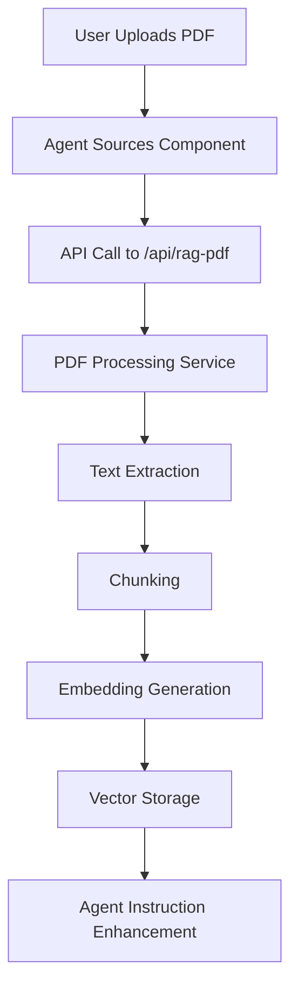

# RAG Implementation Documentation

## Overview

This document describes the implementation of Retrieval-Augmented Generation (RAG) capabilities for AI agents in the SMTG application. The RAG system allows agents to be enhanced with knowledge from PDF documents, enabling them to provide more informed responses during meetings.

## Features Implemented

1. **PDF Document Processing**: Users can upload PDF files to enhance agent knowledge
2. **Text Extraction**: Extract text content from PDF documents
3. **Chunking**: Split documents into manageable chunks for processing
4. **Embedding Generation**: Convert text chunks to vector embeddings
5. **Vector Storage**: Store embeddings in PostgreSQL with pgvector
6. **Knowledge Base Querying**: Retrieve relevant information during agent interactions
7. **Agent Instruction Enhancement**: Automatically enhance agent instructions with RAG capabilities

## Architecture

### Components

1. **Frontend UI**:
   - PDF upload interface in the agent creation form
   - New "PDF Document" option in knowledge sources

2. **API Endpoints**:
   - `/api/rag-pdf` - Process and store PDF documents

3. **Services**:
   - `RAGService` - Core service for RAG operations
   - PDF processing utilities
   - Database utilities for vector storage

4. **Database Schema**:
   - New tables for storing documents and embeddings

### Data Flow



## Implementation Details

### 1. Database Schema Changes

Added two new tables to store document information and embeddings:

```sql
-- Agent Documents Table
CREATE TABLE agent_documents (
    id TEXT PRIMARY KEY,
    agent_id TEXT REFERENCES agents(id),
    name TEXT NOT NULL,
    url TEXT,
    created_at TIMESTAMP NOT NULL DEFAULT NOW(),
    updated_at TIMESTAMP NOT NULL DEFAULT NOW()
);

-- Document Chunks Table
CREATE TABLE document_chunks (
    id TEXT PRIMARY KEY,
    document_id TEXT REFERENCES agent_documents(id),
    page_number TEXT,
    chunk_number TEXT,
    content TEXT NOT NULL,
    embedding VECTOR(1536),
    created_at TIMESTAMP NOT NULL DEFAULT NOW()
);
```

### 2. Frontend Changes

#### Agent Sources Component
- Added support for PDF file uploads
- New `sourceType` option: "pdf"
- File input with validation for PDF files

#### Agent Form
- Added "PDF Document" button to knowledge sources section
- New UI section for PDF uploads

### 3. Backend Services

#### RAG Service
Main service for handling RAG operations:

```typescript
class RAGService {
  static async processPDF(fileBuffer, agentId, fileName);
  static async query(agentId, query, limit);
  static async enhanceInstructions(agentId, baseInstructions);
}
```

#### PDF Processing Utilities
- Text extraction from PDF files
- Text chunking with overlap
- Embedding generation using OpenAI API

#### Database Utilities
- Save document metadata
- Store document chunks with embeddings
- Query similar chunks using vector similarity

### 4. API Endpoints

#### POST /api/rag-pdf
Processes uploaded PDF files:
- Authentication check
- File validation
- PDF processing using RAG service
- Returns processing results

## Usage

### Adding Documents to Agents

1. Navigate to the agent creation or editing page
2. Click on "Knowledge Sources" section
3. Click the "PDF Document" button
4. Select a PDF file to upload
5. The document will be processed and added to the agent's knowledge base

### Agent Behavior

Agents with documents in their knowledge base will have enhanced instructions that inform them about their RAG capabilities. During meetings, they can retrieve relevant information from their documents to provide more informed responses.

## Technical Considerations

### Vector Database

The implementation uses PostgreSQL with the pgvector extension for storing and querying vector embeddings. This allows for efficient similarity searches using cosine similarity.

### Embedding Model

OpenAI's `text-embedding-3-small` model is used for generating embeddings, providing a good balance of performance and cost.

### Text Chunking

Documents are split into chunks of 1000 characters with a 200-character overlap to maintain context between chunks while ensuring efficient processing.

## Future Improvements

1. **Multi-document Support**: Enable querying across multiple documents
2. **Advanced Chunking**: Implement semantic chunking based on content structure
3. **Re-ranking**: Add re-ranking of retrieved chunks for better relevance
4. **Caching**: Implement caching for frequently accessed documents
5. **Document Management**: Add UI for managing and removing documents
6. **Real-time Querying**: Integrate RAG querying directly into meeting interactions

## Testing

Unit tests have been created for the RAG service to ensure proper functionality:
- PDF processing
- Instruction enhancement
- Error handling

## Security

- Authentication is required for all RAG operations
- File type validation prevents non-PDF uploads
- File size limits prevent excessive resource usage